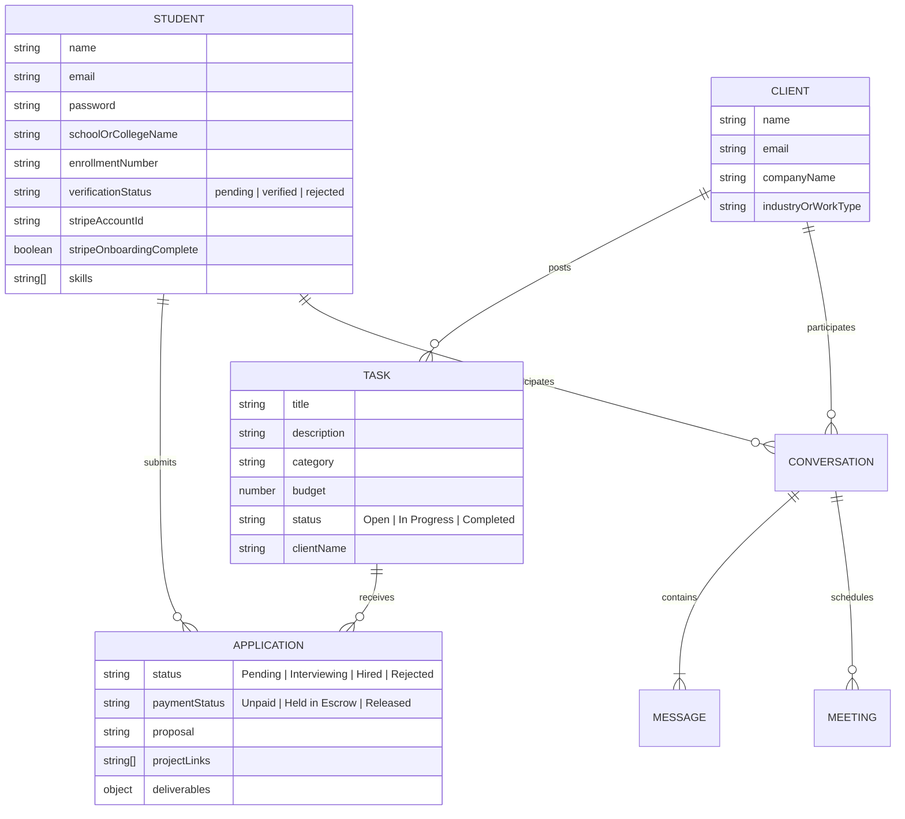
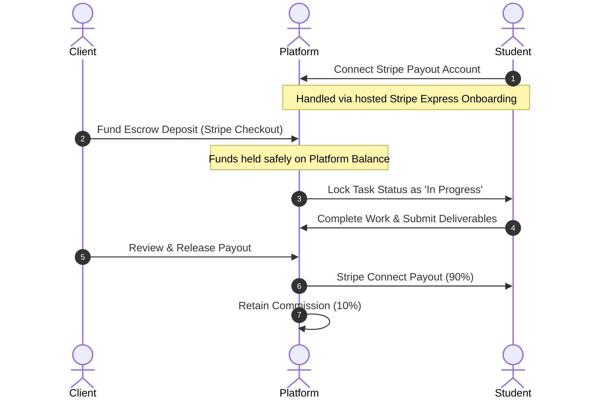

# 🎓 CampusLance

> **A Secure, Smart, and Real-Time Freelancing Platform Tailored for University Ecosystems.**

CampusLance is a premium, end-to-end web application that connects student freelancers with clients seeking high-quality university talent. The platform streamlines the entire lifecycle of a freelance contract—ranging from AI-driven student credentials verification to robust financial escrow protection and interactive collaboration suites.

---

## ✨ Features at a Glance

### 🔍 1. Automated AI Student ID Verification
* **OCR-Powered Verification**: Built-in **Tesseract.js** engine extracts text from student-uploaded physical ID cards.
* **Smart Validation Engine**: Automatically cross-references extracted text against registration profile details, specifically:
  * **Full Name Match**: Verifies matching character sequences in the student's name.
  * **Institution Match**: Validates the name of the school or college.
  * **Enrollment Number Match**: Checks the database enrollment code matches the ID card text.
* **Instant Email Domain Whitelisting**: Students registering with standard academic domains (`.edu`, `.ac.in`, `.edu.in`, `.res.in`) receive instant, automatic trusted status.
* **Graceful Rejection Handling**: Interactive re-upload functionality with detailed auto-generated rejection logs to prompt users for cleaner image submissions.

### 💳 2. Financial Protection with Stripe Escrow & Connect
* **Secure Milestone Escrow**: Prevents non-payment disputes by securely holding project budgets on the platform balance via **Stripe Checkout Sessions** before work begins.
* **Automated Connected Transfers**: Distributes payouts seamlessly to students using **Stripe Connect Express accounts**.
* **Smart Platform Revenue Model**: Deducts a **10% commission** from the payout (transfers 90% of the project budget to the student) upon client approval of deliverables.
* **Developer Simulation Mode**: Gracefully falls back to a sandbox/simulated Connect Express account setup if real Connect features are disabled on testing Stripe developer accounts, ensuring an uninterrupted local testing workflow.

### 💬 3. Real-Time Interactive Collaboration
* **WebSocket Chat Rooms**: Instant communication through **Socket.io** with separate virtual rooms mapped to active database conversations.
* **Milestone Sync Scheduling**: Clients can initiate and schedule review syncs directly inside the conversation drawer.
* **Custom Google Meet Generator**: Automatically constructs unique Google Meet codes dynamically.
* **Automated Nodemailer Sync Invites**: Seamlessly notifies student freelancers of scheduled sync milestones via beautifully styled HTML invite emails dispatched automatically.

### 📊 4. Tailored Premium User Dashboards
* **Student Dashboard**:
  * Track and filter freelance application statuses (*Pending*, *Interviewing*, *Hired*, *Rejected*).
  * Direct workspace where students submit deliverables (GitHub repository URL, descriptions, screenshots, and live demo links).
  * Stripe onboarding console with automated payout tracking.
  * Comprehensive profile management with visual skill tag chips.
* **Client Dashboard**:
  * Clean, interactive interface to publish structured project opportunities with detailed specifications (Skill Requirements, Budget, Deadlines).
  * Dedicated application manager to screen candidate profiles, review proposals, and hire freelancers.
  * Easy-to-use escrow management pipeline to fund deposits and release final payouts.

---

## 🛠️ Technology Stack

### Frontend Architecture
* **Library**: React 19
* **Language**: TypeScript
* **Build Tooling**: Vite
* **Styling**: Tailored Vanilla CSS (glassmorphism details, vibrant dark accents, harmonic custom HSL gradients)
* **Iconography**: Lucide React

### Backend Infrastructure
* **Runtime**: Node.js
* **Framework**: Express 5 (latest cutting-edge routing support)
* **Database**: MongoDB (Mongoose ODM layer)
* **Real-time WebSockets**: Socket.io
* **Email System**: Nodemailer
* **Optical Character Recognition (OCR)**: Tesseract.js
* **Payment Processor**: Stripe API

---

## 📁 Repository Structure

```text
Campus_Freelancing/
├── backend/                  # Node.js + Express Backend Service
│   ├── controllers/          # Business logic controllers (Auth, Chat)
│   ├── models/               # Mongoose schemas (Student, Client, Task, etc.)
│   ├── routes/               # API endpoint routing declarations
│   ├── eng.traineddata       # Pre-downloaded Tesseract OCR language dataset
│   ├── index.js              # Server entry point, Socket.io, & Nodemailer setup
│   └── package.json          # Node dependency configurations
│
└── frontend/                 # React + TypeScript Client Application
    ├── public/               # Static assets & public files
    ├── src/                  # Application source
    │   ├── components/       # UI Components
    │   │   ├── Auth/         # Login & Role-based signup flows
    │   │   ├── Chat/         # Real-time WebSocket chat widgets
    │   │   ├── Dashboard/    # Comprehensive Client & Student workspaces
    │   │   └── Landing/      # Dynamic marketing homepage
    │   ├── App.css           # Global layout adjustments
    │   ├── App.tsx           # Client router and path structure
    │   ├── index.css         # Styling system tokens & animations
    │   └── main.tsx          # Application renderer mount
    ├── vite.config.ts        # Vite configuration script
    └── package.json          # Frontend dependency specifications
```

---

## 💾 Database Schema Overview



---

## 🚀 Local Installation & Setup

Follow these steps to configure and run the entire local development environment.

### Prerequisites
* **Node.js** (v18 or higher recommended)
* **MongoDB** (A local database instance or a free MongoDB Atlas connection string)
* **Stripe Developer Account** (For sandbox testing credentials)

---

### Step 1: Configure the Backend

1. Navigate into the backend directory:
   ```bash
   cd backend
   ```
2. Install dependencies:
   ```bash
   npm install
   ```
3. Create a `.env` file in the root of the `backend/` folder and insert your credentials:
   ```env
   # MongoDB Connection
   MONGO_URL=your_mongodb_connection_string

   # Stripe API Keys (Test Mode)
   STRIPE_SECRET_KEY=your_stripe_secret_key
   VITE_STRIPE_PUBLISHABLE_KEY=your_stripe_publishable_key
   STRIPE_WEBHOOK_SECRET=your_stripe_webhook_secret_signing_key

   # Nodemailer SMTP Configuration (e.g., Mailtrap, Gmail)
   SMTP_HOST=smtp.mailtrap.io
   SMTP_PORT=2525
   SMTP_EMAIL=your_smtp_user
   SMTP_PASSWORD=your_smtp_password
   ```
4. Start the backend developer server:
   ```bash
   npm start
   ```
   *The server defaults to port `5000` (WebSocket connects to `http://localhost:5000`).*

---

### Step 2: Configure the Frontend

1. Open a new terminal and navigate to the frontend directory:
   ```bash
   cd frontend
   ```
2. Install the client packages:
   ```bash
   npm install
   ```
3. Boot the Vite local dev server:
   ```bash
   npm run dev
   ```
   *The frontend starts instantly on `http://localhost:5173`.*

---

## 🔒 Automated Verification Rules

When signing up as a Student, the backend performs the following automated verification checks:

1. **Email Domain Check**: If email ends with `.edu`, `.ac.in`, `.edu.in`, or `.res.in`, registration completes instantly with a `verified` status.
2. **OCR Image Recognition**:
   * If a standard email is used, a valid Student ID Card image must be uploaded as a Base64 encoded file.
   * **Tesseract.js** reads the text inside the uploaded image.
   * If the extracted text contains the student's **Name**, **Institution name**, and **Enrollment Number**, status transitions to `verified`.
   * Otherwise, the registration is set to `rejected` with a customized instruction explanation on the dashboard allowing immediate re-upload.

---

## 💰 Stripe Connect Escrow Workflow



---


